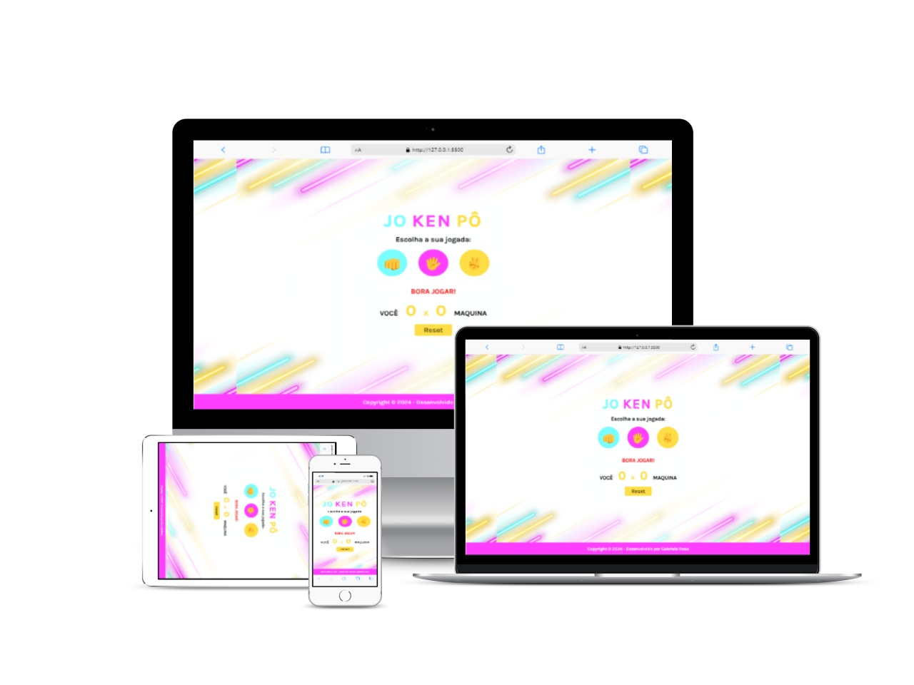

<h1 align="center">Jokenpô</h1>

## 📝 Sobre o projeto

Esse projeto tem como intuito apresentar um jogo muito conhecido, o Jokenpo ou mais conhecido como Pedra - Papel - Tesoura, Esse jogo tem um jogador contra a maquina, com o desenvolvimento desse projeto seguimos colocando em pratica os conteúdos das aulas de Javascript do <a href="https://rodolfomori.com.br/devclub/">DevClub</a>. 
 
Esse projeto está totalmente responsivo, se adaptando tanto para desktop quanto para mobile e tablet.
 
Esse jogo funciona da seguinte forma, é necessário que o jogador escolha uma opção e a logica vai determinar a opção da maquina, depois vai comparar os resultados e ver quem ganho. Sendo que o papel ganha da pedra, já a pedra ganha da tesoura e a tesouta ganha do papel. Assim cada vez que alguem ganhar leva um ponto e é mostrado no placar. Além disso podemos resetar o jogo e começar tudo novamente.

## 💻 Tecnologias utilizadas

